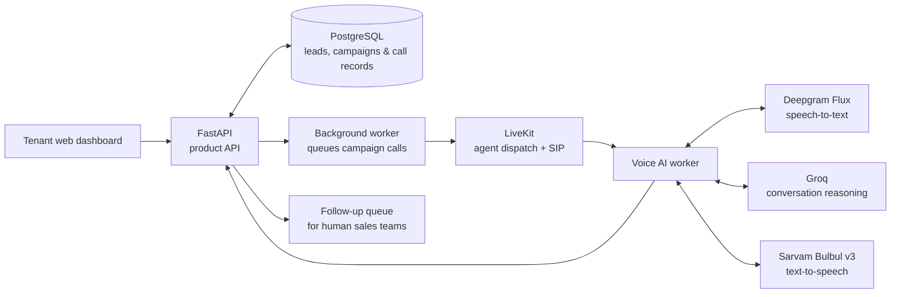

# RingIQ

> **Every new lead deserves a fast first hello. Every sales rep deserves a warmer next conversation.**

RingIQ is an AI voice platform for real-estate teams that turns fresh lead lists into a focused follow-up queue. It calls prospective customers, has natural Hindi, English, or mixed Hindi-English conversations using the business's private knowledge, and gives human sales teams the context to act on genuine interest.

[Open staging](https://ringiq-staging-web.vercel.app/) · [See the product deck](https://ringiq-product-deck.vercel.app) · [Watch the demo](https://youtu.be/T8kWorPbZrU)

[](https://youtu.be/T8kWorPbZrU)

## From lead list to sales-ready follow-up

```text
Upload leads       Ground the agent       Start a campaign          Make the next call count
     │                    │                        │                         │
     ▼                    ▼                        ▼                         ▼
CSV lead list ──► Private business KB ──► Outbound AI calls ──► Hot, warm & callback leads
                                                    │                         │
                                                    └──── summaries, transcripts,
                                                          recordings & knowledge gaps
```

RingIQ is deliberately narrow in v1: it handles the introductory qualification conversation, then hands promising leads back to the sales team. It is not a CRM, an autonomous closer, or a live-transfer console.

## The system behind the call



Tenant data stays scoped to its workspace: lead records, knowledge, transcripts, recordings, and dashboard data are never shared across tenants. The agent is grounded in that tenant's business profile and knowledge base rather than making unsupported claims.

## Quick start

### What you need

- Python 3.11+
- [uv](https://docs.astral.sh/uv/)
- Node.js and npm for the tenant web app
- Credentials for LiveKit/SIP, Deepgram, Groq, Sarvam, PostgreSQL, and Clerk

### Configure the workspace

```bash
cp .env.example .env
uv sync
uv run python -m ringiq
```

`uv sync` creates `.venv` when necessary and aligns Python dependencies with `pyproject.toml`. Fill in the required values in `.env`, including a valid LiveKit SIP outbound trunk.

For the tenant dashboard, create its local environment file:

```bash
cp apps/web/.env.example apps/web/.env.local
```

Set `NEXT_PUBLIC_CLERK_PUBLISHABLE_KEY` and `NEXT_PUBLIC_API_BASE_URL` in `apps/web/.env.local`.

### Run RingIQ locally

Start these services in separate terminals:

| Service | Command | Purpose |
| --- | --- | --- |
| Voice worker | `uv run python -m apps.voice_worker.agent dev` | Runs live AI call sessions. |
| Product API | `uv run uvicorn apps.api.ringiq_api.main:app --reload` | Serves the product and demo APIs. |
| Job worker | `uv run python -m apps.worker.main` | Claims campaign/click-to-call jobs and dispatches calls. |
| Web app | `npm run web:dev` | Runs the tenant dashboard. |

Product call APIs place work in PostgreSQL; the job worker claims it and dispatches the LiveKit agent and outbound SIP participant. The demo endpoint is intentionally simpler: it dispatches directly and does not require the job worker.

### Place a demo call

With the API and voice worker running:

```bash
curl -X POST http://127.0.0.1:8000/demo/calls \
  -H "Content-Type: application/json" \
  -d '{"phone_number":"+919876543210"}'
```

The phone number must be in E.164 format. A configured LiveKit SIP outbound trunk is required before RingIQ can place a call.

## Operating notes

- Set `RINGIQ_API_BASE_URL` so the voice worker can report LiveKit, Deepgram, Groq, and Sarvam milestones to the API.
- Run one voice-worker process per local environment.
- RingIQ removes the LiveKit room when call startup fails.
- A call shuts down if its SIP participant does not arrive within `LIVEKIT_SIP_PARTICIPANT_WAIT_TIMEOUT_SECONDS`.
- Campaign-call transcripts are persisted to the API when `RINGIQ_INTERNAL_API_KEY` is configured. Recording is optional and requires `LIVEKIT_RECORDING_ENABLED=true` plus the `LIVEKIT_RECORDING_S3_*` settings.

## Repository guide

```text
apps/
  api/            FastAPI product backend
  worker/         PostgreSQL-backed background jobs
  voice_worker/   Real-time LiveKit voice runtime
  web/            Tenant-facing Next.js dashboard
packages/         Shared internal packages
infra/            Local and deployment infrastructure
docs/             Implementation documentation
```

For service-specific details, see the [API](apps/api/README.md), [voice worker](apps/voice_worker/README.md), [web app](apps/web/README.md), and [infrastructure](infra/README.md) READMEs. Planning artifacts live in `_bmad-output/planning-artifacts`.

## Platform console

RingIQ operators use the separate platform entrance at `http://localhost:3000/platform/sign-in`. Platform identities do not belong to a Clerk organization, while tenant routes require an active organization. Enable **Allow Personal Accounts** in Clerk before inviting platform users.

Apply database migrations, then bootstrap the first super administrator:

```bash
uv run alembic upgrade head
uv run python -m scripts.bootstrap_platform_user \
  --email admin@ringiq.in \
  --display-name "RingIQ Admin"
```

Configure the Clerk webhook at `/webhooks/clerk` for `user.created`, `user.updated`, and `user.deleted`; set its secret in `CLERK_WEBHOOK_SIGNING_SECRET`. Set `PLATFORM_INVITATION_REDIRECT_URL` to the web app's `/platform/accept-invitation` URL.

For recovery, an existing dedicated Clerk identity can be provisioned with `--clerk-user-id`; after an upgrade, run `uv run python -m scripts.bootstrap_platform_user --reconcile-metadata`. PostgreSQL remains the source of truth for platform authorization; Clerk private metadata is an operational mirror.
