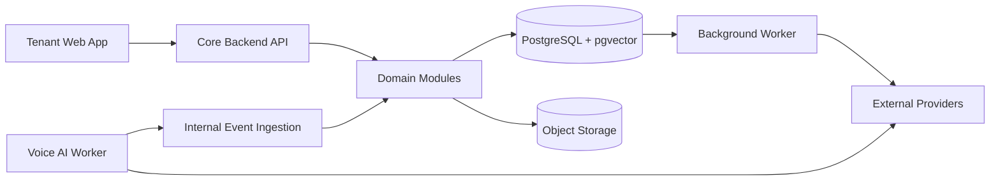
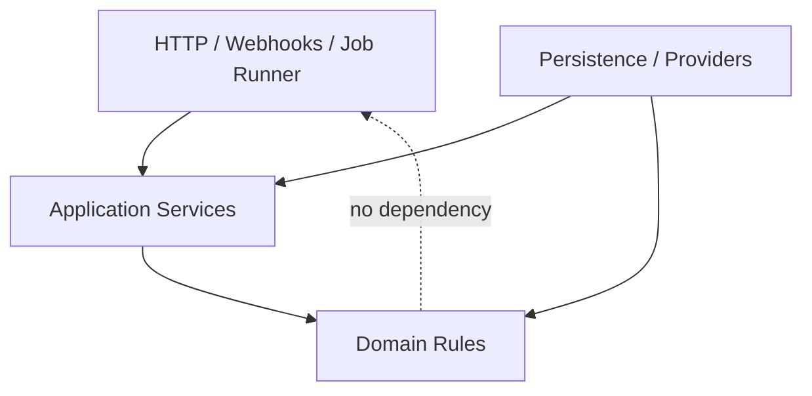

# Architecture Spine - RingIQ Platform

## Design Paradigm

RingIQ is a modular monolith for product workflows with isolated background and real-time workers. The Core Backend owns product policy and state; workers execute jobs or live conversations through explicit contracts.



Dependency direction is inward: transports and workers depend on application contracts; application modules depend on domain rules; domain rules do not depend on providers, web frameworks, or worker runtimes.

## Invariants And Rules

### AD-1 - Keep product domains modular inside one backend

- **Binds:** Core Backend, Background Worker, Voice AI Worker
- **Prevents:** Independent lead, campaign, knowledge, and dashboard services duplicating authorization and state policy.
- **Rule:** Lead, campaign, knowledge, call-record, and dashboard capabilities remain modules in the Core Backend. Only background execution and live voice execution are separate deployables.

### AD-2 - Enforce tenant isolation in every persistence path

- **Binds:** All tenant-owned records, retrieval, jobs, object storage, API access
- **Prevents:** Cross-tenant reads, associations, retrieval results, jobs, and artifacts.
- **Rule:** Every tenant-owned row carries `tenant_id`; application queries scope explicitly; PostgreSQL RLS applies a transaction-local tenant context; composite tenant-aware foreign keys prevent cross-tenant links; jobs, retrieval filters, and object keys carry the same tenant identity.

### AD-3 - Give the Core Backend sole ownership of product state

- **Binds:** Voice AI Worker, Background Worker, provider webhooks, product tables
- **Prevents:** Workers bypassing authorization, invariants, or valid state transitions.
- **Rule:** Shared Core application services are the only product-state mutation path. Background Workers invoke those services for leased jobs; Voice AI Workers emit idempotent events through the internal ingestion contract. Live media processing never waits for persistence.

### AD-4 - Separate stable lead identity from adaptable vertical data

- **Binds:** Leads, imports, qualification, filtering, future categories
- **Prevents:** A table per vertical or an unvalidated property bag.
- **Rule:** Stable contact fields are relational columns. Category and tenant-specific values use schema-validated `JSONB` governed by versioned field definitions; broadly stable fields may later be promoted through migrations.

### AD-5 - Version knowledge while activating updates between calls

- **Binds:** Knowledge publishing, campaigns, retrieval, call audit
- **Prevents:** Stale campaigns and knowledge changes during an active conversation.
- **Rule:** Publishing creates an immutable indexed KB version and atomically changes the tenant's active pointer. Call-attempt creation pins the active version in the same transaction; active calls never switch versions. Business-profile and agent-configuration versions remain campaign-pinned.

### AD-6 - Preserve the lead-to-call lifecycle as separate records

- **Binds:** Leads, imports, campaigns, retries, calls, dashboard outcomes
- **Prevents:** Reused leads overwriting campaign history or retries collapsing into one row.
- **Rule:** Model reusable Lead -> Campaign Enrollment -> Call Attempt -> Conversation Artifacts. Each attempt captures the exact call context and every campaign permits one enrollment per lead.

### AD-7 - Keep knowledge structured and traceable

- **Binds:** Q&A templates, tenant answers, sources, chunks, embeddings, retrieval
- **Prevents:** Flattened prompt text losing source lineage or blocking future source types.
- **Rule:** Category Q&A templates and tenant answers remain structured. Published KB versions contain typed sources, chunks, embeddings, and source lineage. V1 exposes Q&A and manual text; new source types extend the source envelope.

### AD-8 - Split queryable call data from binary artifacts

- **Binds:** Transcripts, recordings, uploads, exports, retention
- **Prevents:** Large binaries degrading relational workloads or file-only transcripts blocking dashboard queries.
- **Rule:** Queryable transcript and call facts live in PostgreSQL. Recordings and other binary artifacts live in private tenant-prefixed object storage; the Core API authorizes short-lived access.

### AD-9 - Map Clerk identity into RingIQ membership

- **Binds:** Authentication, tenants, users, authorization, future RBAC
- **Prevents:** Treating Clerk claims as product-data authorization or assuming one user has one tenant.
- **Rule:** Clerk users and organizations map to internal users, tenants, and active memberships. V1 membership permissions are uniform; Clerk webhooks synchronize identity idempotently.

### AD-10 - Deduplicate leads within a tenant by normalized phone

- **Binds:** CSV imports, leads, campaigns
- **Prevents:** Duplicate imported rows producing duplicate lead records and calls.
- **Rule:** Active leads are unique by `(tenant_id, normalized_phone_number)`. Every import row remains auditable and resolves to a lead; cross-tenant matches are unrelated.

### AD-11 - Use PostgreSQL-backed durable jobs and outbox

- **Binds:** Imports, embeddings, campaign scheduling, retries, post-call work
- **Prevents:** Lost work between state commits and job publication or duplicate concurrent calls.
- **Rule:** Product changes and required jobs commit atomically. A restricted queue-control role or privileged function claims leased jobs across tenants with `FOR UPDATE SKIP LOCKED`; job handlers then enter tenant-scoped application transactions. Idempotency, bounded retries, dead-letter states, and one active call attempt per enrollment are mandatory.

### AD-12 - Preserve evidence and derived outputs separately

- **Binds:** Transcripts, summaries, classifications, callbacks, knowledge gaps, audits
- **Prevents:** Later processing silently rewriting what happened during a call.
- **Rule:** Provider events and finalized transcript evidence are append-only. Summaries, classifications, and corrected derivatives are versioned or superseded with provenance.

## Consistency Conventions

| Concern | Convention |
| --- | --- |
| Identifiers | UUID primary keys; external provider IDs are separate unique attributes. |
| Tenant foreign keys | Tenant-owned parents expose `UNIQUE (tenant_id, id)`; children reference both columns. |
| Time | `timestamptz` in UTC; tenant settings store an IANA timezone for display and interpretation. |
| Naming | `snake_case` tables/columns; singular domain terms in code; past-tense event names. |
| Flexible data | `JSONB` only behind a documented schema/version; no ungoverned business fields. |
| State mutation | Domain services enforce explicit transitions; ingestion and webhook handlers are idempotent. |
| Deletion | Soft lifecycle state for user-facing records; immutable audit/evidence until retention policy authorizes deletion. |
| Secrets | Provider secrets remain in deployment secret stores and never in product tables. |

## Stack

| Name | Version |
| --- | --- |
| Python | 3.11 |
| FastAPI | 0.139.2 |
| LiveKit Agents | 1.6.5 |
| LiveKit API | 1.2.0 |
| Pydantic | 2.13.4 |
| PostgreSQL | 18.4 |
| pgvector | 0.8.2 |

## Structural Seed

```text
apps/
  api/             # Core Backend transport and composition
  worker/          # PostgreSQL-backed background jobs
  voice_worker/    # LiveKit real-time call runtime
  web/             # Tenant application
packages/
  domain/          # Provider-independent domain rules and state transitions
  application/     # Commands, queries, event contracts, ports
  infrastructure/  # Postgres, object storage, Clerk, provider adapters
```



## Capability To Architecture Map

| Capability | Lives in | Governed by |
| --- | --- | --- |
| Tenant workspace and access | Tenant/Auth module | AD-2, AD-9 |
| Lead import and reusable leads | Import and Lead modules | AD-4, AD-6, AD-10 |
| Knowledge Q&A and retrieval | Knowledge module and Background Worker | AD-2, AD-5, AD-7 |
| Campaign execution and retries | Campaign module and Background Worker | AD-6, AD-11 |
| Live voice conversation | Voice AI Worker | AD-3, AD-5 |
| Call history and follow-up | Call Records and Dashboard modules | AD-6, AD-8, AD-12 |
| Recordings and transcripts | Call Records and Artifact modules | AD-2, AD-8, AD-12 |

## Deferred

- ORM and migration-library selection: choose when database implementation starts.
- PostgreSQL job-runner library: select after load and deployment constraints are known; AD-11 fixes semantics.
- Embedding provider, model, and dimensions: bind per KB version when retrieval implementation begins.
- Object-storage provider: choose per deployment while preserving AD-8.
- Table partitioning: introduce for call events, transcripts, audits, and jobs after measured growth.
- Message broker: introduce only when PostgreSQL job throughput or event fan-out becomes a measured constraint.
- RBAC, DND/consent, billing, CRM integration, automated scheduling, live transfer, and configurable retention remain additive capabilities outside V1.
- Production topology, regional placement, backup objectives, and disaster-recovery targets require a separate deployment design before production launch.
