# RingIQ Low-Level Design And ERD

Date: 2026-07-17  
Status: Implementation-ready design  
Audience: RingIQ engineers and coding agents  
Companion: [Architecture Spine](ARCHITECTURE-SPINE.md)

## 1. Purpose And Scope

This document defines the implementation-level component design, domain boundaries, lifecycle rules, logical PostgreSQL schema, tenant-isolation controls, important constraints, and indexing strategy for RingIQ V1.

It covers the Tenant Web App, Core SaaS Backend, Background Worker, Voice AI Worker, PostgreSQL with pgvector, object storage, Clerk, and voice providers. It does not define complete HTTP payload schemas, SQL migrations, infrastructure provisioning, billing, DND/consent workflows, or automated live transfer.

## 2. Adopted Design

| Area | Decision |
| --- | --- |
| Architecture | Modular Core Backend with isolated Background and Voice AI workers. |
| Tenancy | Shared database and schema with mandatory `tenant_id`, application scoping, tenant-aware foreign keys, and PostgreSQL RLS. |
| Product state | Shared Core application services are the sole policy and product-state mutation path. |
| Lead flexibility | Relational contact columns plus validated `JSONB` attributes governed by versioned definitions. |
| Lead identity | Tenant-scoped E.164 phone number deduplication. |
| Campaign lifecycle | Lead -> Campaign Enrollment -> Call Attempt -> Conversation Artifacts. |
| Knowledge | Structured, versioned sources and chunks; publication changes the active version for the next call. |
| Call context | Each call pins the active KB version and snapshots the exact context used. |
| Artifacts | Queryable data in PostgreSQL; recordings and binaries in private object storage. |
| Jobs | PostgreSQL-backed durable jobs and transactional outbox. |
| Auth | Clerk identity and organizations mapped to internal users, tenants, and memberships. |

## 3. Runtime Components

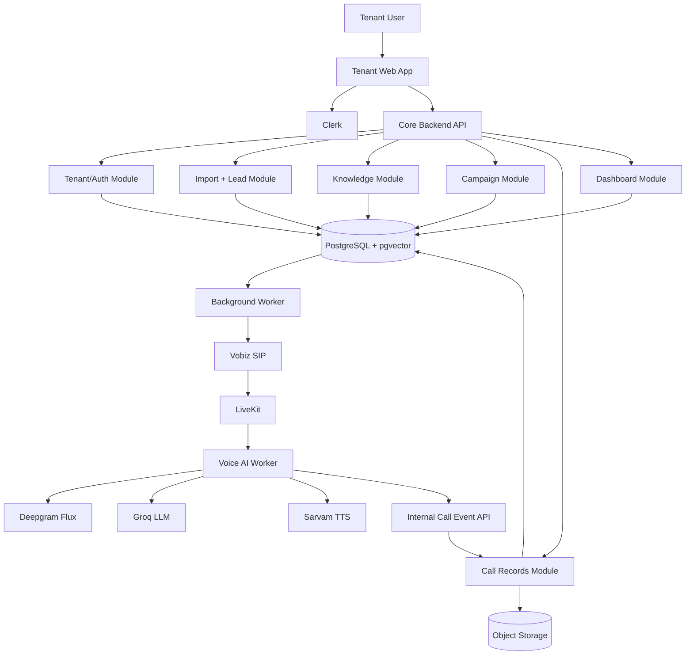

### 3.1 Core Backend Modules

| Module | Owns | May Call |
| --- | --- | --- |
| Tenant/Auth | Clerk mappings, memberships, tenant context, RLS transaction setup | Clerk adapter, audit module |
| Import | Upload metadata, row validation, lead resolution | Lead module, artifact module, job module |
| Lead | Lead identity, contact data, attributes, deduplication | Field-definition module, audit module |
| Business Configuration | Business profile and agent-configuration versions | Knowledge readiness checks |
| Knowledge | Q&A templates, answers, sources, versions, publication, retrieval metadata | Job module, artifact module |
| Campaign | Campaign readiness, enrollment, scheduling, retry policy, progress | Lead, Knowledge, Business Configuration, Job modules |
| Call Records | Attempt transitions, events, conversations, transcripts, outcomes, callbacks, gaps | Artifact and audit modules |
| Dashboard | Tenant-scoped read models and aggregate queries | Lead, Campaign, Call Records, Knowledge modules |
| Job/Outbox | Atomic background work, leases, retries, dead-letter state | No product-policy ownership |
| Audit | Actor/action/resource records for sensitive mutations | Append-only writes |

Modules call each other through application services, not by mutating another module's tables directly.

### 3.2 Background Worker Responsibilities

- Parse and validate CSV import rows.
- Resolve or create tenant leads.
- Build KB source records, chunks, and embeddings.
- Publish a fully indexed KB version atomically.
- Enqueue and claim campaign call work.
- Create call attempts and initiate provider calls.
- Schedule unanswered-call retries.
- Perform post-call summary, classification, and gap extraction when not completed inline.
- Deliver outbox events and retry transient integration failures.

Background Workers invoke the same Core application services and state-transition rules used by API handlers. They do not implement a second set of product policies.

### 3.3 Voice AI Worker Responsibilities

- Accept a minimal signed call context for one `call_attempt_id`.
- Join the assigned LiveKit room and run the STT -> retrieval -> LLM -> TTS loop.
- Use only the `knowledge_base_version_id` pinned to the active call.
- Keep persistence asynchronous and outside the media-response critical path.
- Emit idempotent call events, transcript batches, retrieval traces, and final results.
- Never write product tables directly.

## 4. Boundary Contracts

### 4.1 Public API Groups

| Route group | Purpose |
| --- | --- |
| `/v1/me` and `/v1/tenant` | Current user, selected tenant, and tenant settings. |
| `/v1/lead-imports` | Upload, validate, inspect row failures, and resolve leads. |
| `/v1/leads` | List, filter, inspect, and explicitly edit reusable leads. |
| `/v1/business-profile` | Edit drafts and publish business-profile versions. |
| `/v1/knowledge-base` | Read Q&A template, edit draft answers/additional text, publish, and inspect indexing status. |
| `/v1/campaigns` | Create, validate readiness, start, pause, cancel, and inspect progress. |
| `/v1/calls` | Call history, transcript, recording access, summary, outcome, and events. |
| `/v1/follow-ups` | Hot, warm, and callback-requested lead queue. |
| `/v1/knowledge-gaps` | List and filter unresolved call knowledge gaps. |

All tenant routes derive tenant identity from the verified Clerk token's active organization and internal active membership. Client-supplied `tenant_id` is never trusted as authorization.

### 4.2 Internal Voice Contracts

`GET /internal/v1/call-attempts/{attempt_id}/context`

- Requires a short-lived signed worker token bound to one attempt.
- Returns tenant, lead context, campaign-pinned profile/agent versions, call-pinned KB version, locale, and provider settings references.
- Does not return unrelated tenant configuration or long-lived provider secrets.

`POST /internal/v1/call-events:batch`

- Accepts one or more events with `event_id`, `call_attempt_id`, `event_type`, `occurred_at`, optional sequence number, and typed payload.
- Deduplicates by event ID and validates attempt/tenant association from the worker token.
- Returns accepted, duplicate, and rejected event IDs independently.
- May receive events out of order; domain transitions reject stale regressions while preserving raw event evidence.

### 4.3 Provider Webhooks

| Endpoint | Rule |
| --- | --- |
| `/webhooks/clerk` | Verify signature, deduplicate delivery ID, synchronize users/organizations/memberships. |
| `/webhooks/vobiz` | Verify provider authenticity, deduplicate provider event, map external call ID to attempt. |
| `/webhooks/livekit` | Verify signature, preserve room/participant lifecycle events, map to attempt. |

Webhook handlers acknowledge duplicates successfully and never infer tenant ownership from an unverified payload field.

## 5. Core Workflows

### 5.1 Tenant Request And RLS

```mermaid
sequenceDiagram
    participant W as Web App
    participant C as Clerk
    participant A as Core API
    participant D as PostgreSQL

    W->>C: Obtain token for active organization
    W->>A: Request with bearer token
    A->>A: Verify token and organization claim
    A->>D: Call restricted identity resolver
    A->>D: BEGIN; SET LOCAL app.tenant_id
    A->>D: Execute tenant-scoped query under RLS
    D-->>A: Tenant rows only
    A-->>W: Response
```

The runtime database role must not own tenant tables and must not have `BYPASSRLS`. Administrative migrations use a separate role.

### 5.2 Lead Import

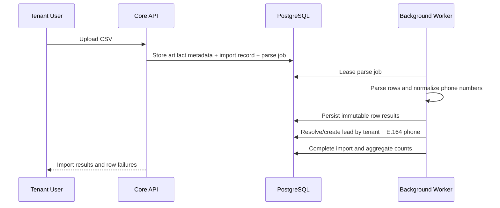

Duplicate valid rows link to the same lead. Imported data fills empty fields but does not silently replace populated lead data.

### 5.3 Knowledge Publication

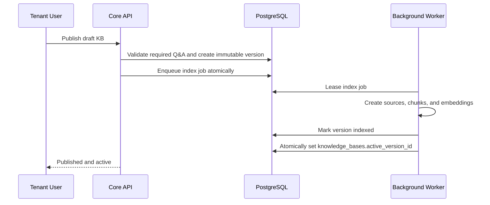

A failed indexing job leaves the previous active version untouched. Calls started after the active-pointer transaction commit use the new version.

### 5.4 Campaign And Call Attempt

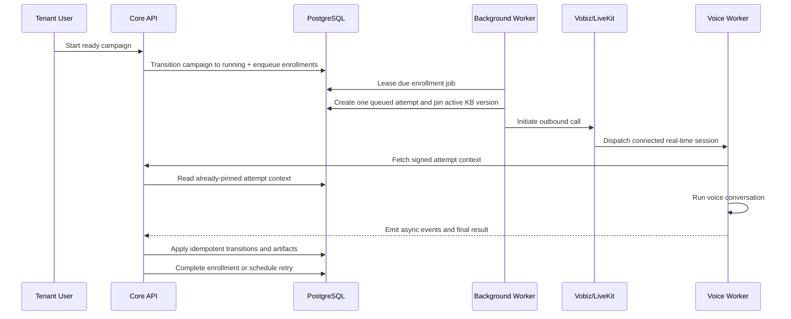

The active KB version is resolved in the call-attempt creation transaction. Retries are created only for configured retryable terminal outcomes. A connected call ends V1 introductory calling for that enrollment.

## 6. State Models

### 6.1 Campaign

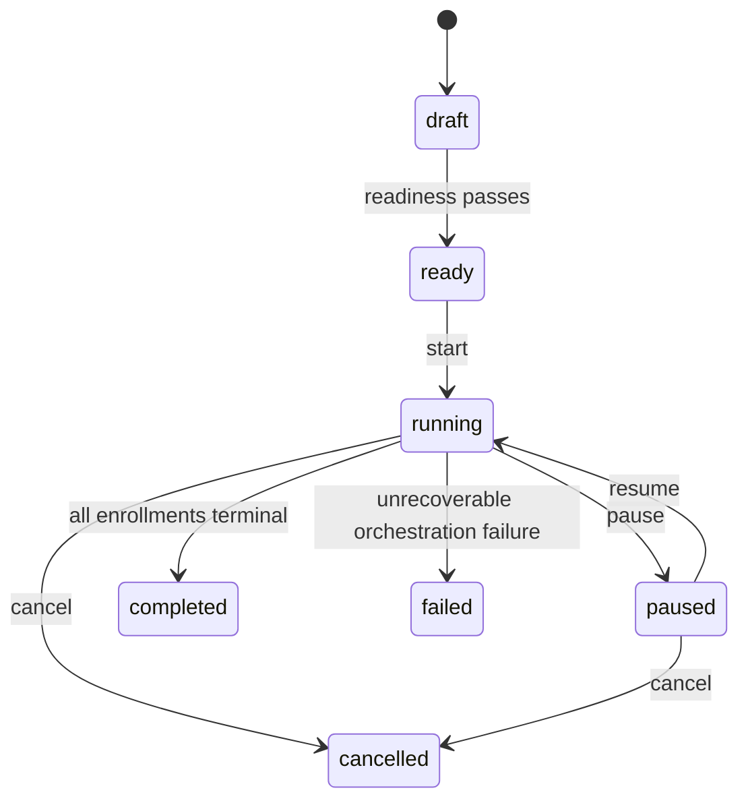

### 6.2 Campaign Enrollment

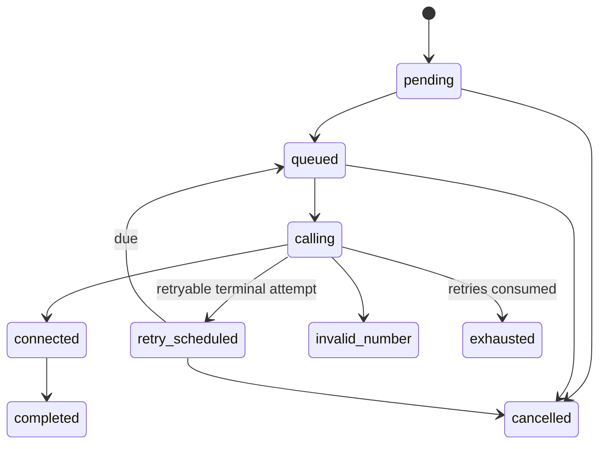

### 6.3 Call Attempt

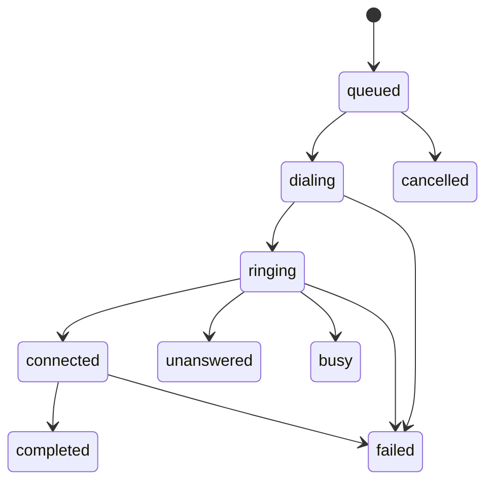

`invalid_number` is a terminal attempt status that may be set before dialing or from a provider response. State transitions are application-service rules; database checks restrict known values but do not encode workflow in triggers.

### 6.4 Knowledge Version

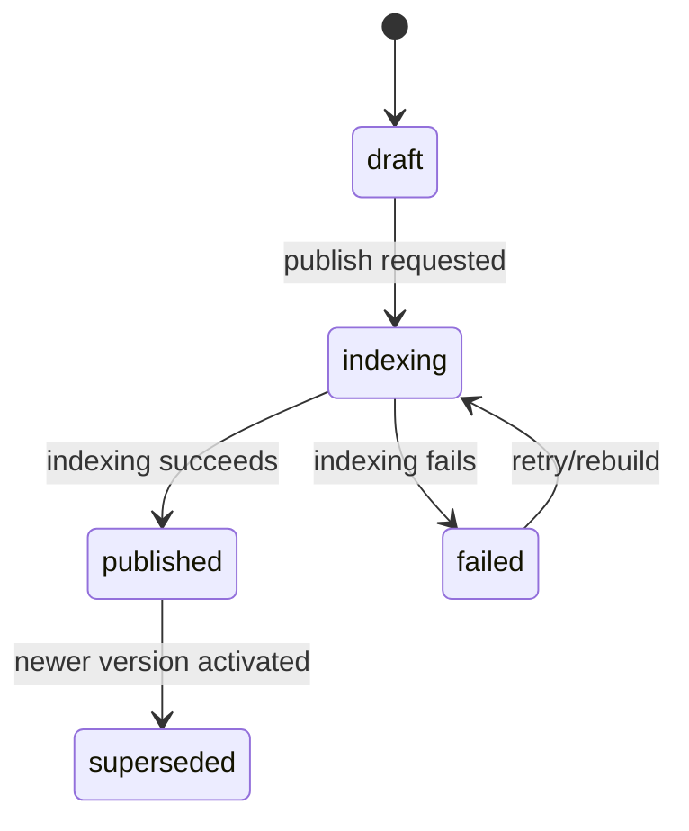

## 7. Data Conventions

### 7.1 Common Tenant Columns

Every tenant-owned table contains:

| Column | Type | Rule |
| --- | --- | --- |
| `id` | `uuid` | Primary key, generated server-side. |
| `tenant_id` | `uuid` | Required; participates in RLS and tenant-aware foreign keys. |
| `created_at` | `timestamptz` | UTC creation timestamp. |
| `updated_at` | `timestamptz` | UTC last mutation timestamp where mutation is allowed. |

Tenant-owned parent tables also expose `UNIQUE (tenant_id, id)`. Child tables use composite foreign keys such as `(tenant_id, campaign_id) REFERENCES campaigns (tenant_id, id)`.

### 7.2 General Rules

- Use UUIDs internally; never use phone number, email, Clerk ID, or provider ID as a primary key.
- Store phone numbers in E.164 and retain raw imported values in import rows.
- Store timestamps as UTC `timestamptz`; store tenant display timezone as an IANA identifier.
- Use `citext` or normalized lowercase values for case-insensitive email comparison, but do not make email globally unique.
- Use PostgreSQL enums only for values that are extremely stable; otherwise use text with `CHECK` constraints to ease migrations.
- Use `JSONB` for versioned schemas, provider payload subsets, and vertical attributes; do not use it to replace relational ownership or lifecycle fields.
- Store money as integer minor units plus ISO currency when exact amounts are collected; descriptive budget ranges may remain structured JSON attributes.
- Store content checksums for immutable sources and artifacts.

## 8. ERD - Identity And Configuration

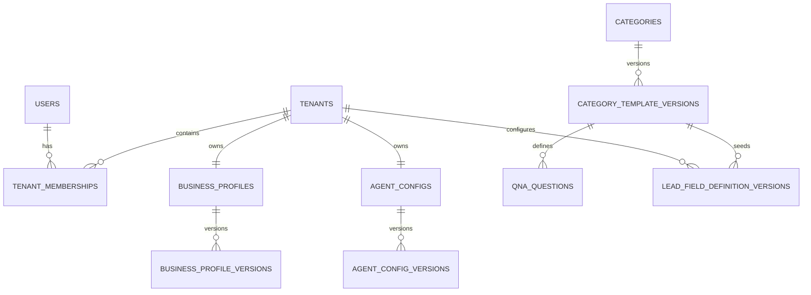

### 8.1 Identity Tables

| Table | Key columns | Constraints and indexes |
| --- | --- | --- |
| `tenants` | `id`, `clerk_organization_id`, `name`, `slug`, `category_id`, `timezone`, `status`, `settings_json` | Unique Clerk organization ID; unique normalized slug; timezone required. |
| `users` | `id`, `clerk_user_id`, `primary_email`, `display_name`, `status`, `last_synced_at` | Unique Clerk user ID; no `tenant_id` because users may join multiple tenants. |
| `tenant_memberships` | `tenant_id`, `user_id`, `clerk_membership_id`, `status`, `role_key` | Unique `(tenant_id, user_id)` and Clerk membership ID; index `(user_id, status)`. V1 ignores `role_key` for product authorization. |
| `webhook_receipts` | `provider`, `delivery_id`, `event_type`, `received_at`, `processed_at`, `status`, `payload_hash`, `error` | Unique `(provider, delivery_id)`; payload may be stored in protected object storage when needed. |

### 8.2 Versioned Configuration Tables

| Table | Key columns | Constraints and indexes |
| --- | --- | --- |
| `categories` | `id`, `key`, `name`, `status` | Global table; unique key such as `real_estate`. |
| `category_template_versions` | `id`, `category_id`, `version`, `status`, `published_at`, `lead_schema_json` | Global table; unique `(category_id, version)`; published rows immutable. |
| `qna_questions` | `id`, `category_template_version_id`, `key`, `label`, `help_text`, `answer_type`, `required`, `display_order`, `validation_json` | Unique `(category_template_version_id, key)` and display-order index. |
| `business_profiles` | `tenant_id`, `active_version_id`, `draft_version_id` | One row per tenant. Active version must belong to the same profile and tenant. |
| `business_profile_versions` | `tenant_id`, `business_profile_id`, `version`, `status`, `content_json`, `published_at`, `created_by_user_id` | Unique `(business_profile_id, version)`; published content immutable. |
| `agent_configs` | `tenant_id`, `active_version_id` | One logical agent configuration per tenant in V1. |
| `agent_config_versions` | `tenant_id`, `agent_config_id`, `version`, `status`, `system_prompt_version`, `generated_flow_json`, `voice_json`, `llm_json`, `published_at` | Unique `(agent_config_id, version)`; provider secrets excluded. |
| `lead_field_definition_versions` | `tenant_id`, `field_key`, `version`, `category_template_version_id`, `label`, `data_type`, `required_on_import`, `ai_may_ask`, `filterable`, `validation_json`, `status` | Unique `(tenant_id, field_key, version)`; one active version per `(tenant_id, field_key)` through a partial unique index. |

`lead_field_definition_versions` contains seeded real-estate definitions and tenant-added custom definitions. Every call context snapshots the effective definitions used for qualification.

## 9. ERD - Leads, Campaigns, And Calls

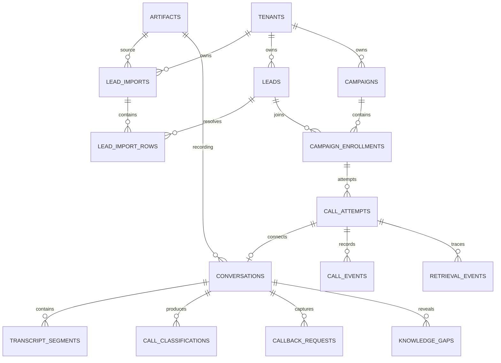

### 9.1 Import And Lead Tables

| Table | Key columns | Constraints and indexes |
| --- | --- | --- |
| `artifacts` | `tenant_id`, `object_key`, `purpose`, `media_type`, `size_bytes`, `checksum`, `storage_provider`, `encryption_key_ref`, `retention_state`, `deleted_at` | Unique object key; index `(tenant_id, purpose, created_at DESC)`; object key begins with tenant ID. |
| `lead_imports` | `tenant_id`, `source_artifact_id`, `filename`, `status`, `total_rows`, `valid_rows`, `rejected_rows`, `duplicate_rows`, `created_by_user_id`, `completed_at` | Index `(tenant_id, status, created_at DESC)`. |
| `lead_import_rows` | `tenant_id`, `lead_import_id`, `row_number`, `raw_data_json`, `normalized_data_json`, `status`, `rejection_codes_json`, `resolved_lead_id` | Unique `(lead_import_id, row_number)`; indexes `(tenant_id, lead_import_id, status)` and `(tenant_id, resolved_lead_id)`. Rows are immutable after import completion. |
| `leads` | `tenant_id`, `name`, `email`, `phone_raw`, `phone_e164`, `attributes_json`, `status`, `source_first_import_id`, `archived_at` | Partial unique `(tenant_id, phone_e164) WHERE archived_at IS NULL`; GIN on `attributes_json`; indexes for tenant/status and normalized email. |

JSON attribute filters that become frequent receive targeted expression indexes. A general GIN index is not a substitute for measured query indexes.

### 9.2 Campaign Tables

| Table | Key columns | Constraints and indexes |
| --- | --- | --- |
| `campaigns` | `tenant_id`, `name`, `status`, `source_import_id`, `business_profile_version_id`, `agent_config_version_id`, `category_template_version_id`, `retry_limit`, `retry_policy_json`, `started_at`, `completed_at`, `created_by_user_id` | Retry limit defaults to 3 after initial attempt; indexes `(tenant_id, status, created_at DESC)` and source import. |
| `campaign_enrollments` | `tenant_id`, `campaign_id`, `lead_id`, `status`, `attempt_count`, `next_attempt_at`, `final_classification`, `final_call_attempt_id`, `last_error_code` | Unique `(campaign_id, lead_id)`; indexes `(tenant_id, campaign_id, status)`, `(tenant_id, status, next_attempt_at)`, and lead history. |
| `call_attempts` | `tenant_id`, `campaign_enrollment_id`, `attempt_number`, `status`, `scheduled_at`, `started_at`, `answered_at`, `ended_at`, `duration_seconds`, `provider`, `provider_call_id`, `livekit_room_name`, `knowledge_base_version_id`, `context_snapshot_json`, `failure_code`, `failure_detail` | Unique `(campaign_enrollment_id, attempt_number)` and provider call ID when present; partial unique active attempt per enrollment; indexes by tenant/status/scheduled time and provider ID. |

The partial active-attempt constraint covers `queued`, `dialing`, `ringing`, and `connected` states. Attempt creation and enrollment transition occur in one transaction.

### 9.3 Conversation And Outcome Tables

| Table | Key columns | Constraints and indexes |
| --- | --- | --- |
| `conversations` | `tenant_id`, `call_attempt_id`, `status`, `primary_language`, `started_at`, `ended_at`, `recording_artifact_id`, `summary_text`, `summary_version`, `summary_status` | Unique call attempt ID; index `(tenant_id, started_at DESC)`. |
| `call_events` | `tenant_id`, `call_attempt_id`, `event_id`, `event_type`, `source`, `sequence_number`, `occurred_at`, `received_at`, `payload_json` | Unique `(tenant_id, event_id)`; optional unique `(call_attempt_id, source, sequence_number)`; time-ordered index. Append-only. |
| `transcript_segments` | `tenant_id`, `conversation_id`, `segment_id`, `sequence_number`, `speaker`, `text`, `language`, `start_offset_ms`, `end_offset_ms`, `is_final`, `provider_confidence`, `created_at` | Unique `(conversation_id, segment_id)` and `(conversation_id, sequence_number)` for final segments; append-only after finalization. |
| `retrieval_events` | `tenant_id`, `call_attempt_id`, `knowledge_base_version_id`, `turn_sequence`, `query_text`, `returned_chunk_ids`, `scores_json`, `latency_ms`, `created_at` | Unique `(call_attempt_id, turn_sequence)`; tenant/KB index. Do not store another tenant's chunk IDs. |
| `call_classifications` | `tenant_id`, `conversation_id`, `version`, `label`, `confidence`, `rationale`, `evidence_json`, `model_ref`, `created_at`, `superseded_at` | Unique `(conversation_id, version)`; one current version through partial index; label check for V1 outcomes. |
| `callback_requests` | `tenant_id`, `conversation_id`, `lead_id`, `original_phrase`, `callback_at`, `timezone`, `status`, `transcript_segment_id`, `completed_at` | Index `(tenant_id, status, callback_at)` and lead ID. V1 statuses: requested, acknowledged, completed, cancelled. |
| `knowledge_gaps` | `tenant_id`, `conversation_id`, `lead_id`, `campaign_id`, `question_text`, `context_text`, `transcript_segment_id`, `status`, `resolution_note`, `resolved_at` | Index `(tenant_id, status, created_at DESC)` and campaign/date. |

V1 classification labels are `hot`, `warm`, `cold`, `callback_requested`, `not_interested`, `unanswered`, `invalid_number`, and `needs_review`. Unanswered and invalid-number outcomes may be represented from attempt/enrollment state without a connected conversation.

## 10. ERD - Knowledge Base And Retrieval

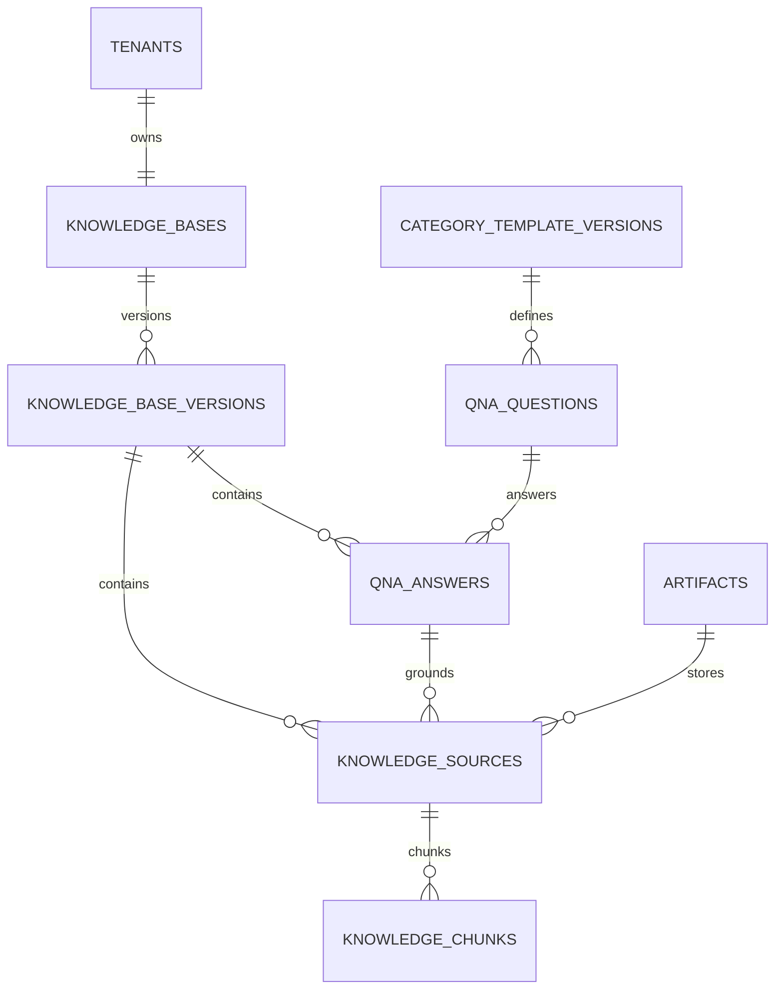

### 10.1 Knowledge Tables

| Table | Key columns | Constraints and indexes |
| --- | --- | --- |
| `knowledge_bases` | `tenant_id`, `active_version_id`, `draft_version_id` | One row per tenant; active/draft versions must belong to the same tenant and KB. |
| `knowledge_base_versions` | `tenant_id`, `knowledge_base_id`, `version`, `category_template_version_id`, `status`, `embedding_model`, `embedding_dimensions`, `chunking_config_json`, `published_at`, `published_by_user_id`, `content_checksum` | Unique `(knowledge_base_id, version)` and checksum as appropriate; index by tenant/status. Published rows are immutable. |
| `qna_answers` | `tenant_id`, `knowledge_base_version_id`, `question_id`, `answer_json`, `answer_text`, `source_updated_at` | Unique `(knowledge_base_version_id, question_id)`; required-question completeness checked before indexing. |
| `knowledge_sources` | `tenant_id`, `knowledge_base_version_id`, `source_type`, `title`, `content_text`, `qna_answer_id`, `artifact_id`, `metadata_json`, `checksum`, `status` | Exactly one source payload path is required by source type; unique checksum within version where useful; index by version/status. |
| `knowledge_chunks` | `tenant_id`, `knowledge_base_version_id`, `knowledge_source_id`, `chunk_index`, `content`, `token_count`, `metadata_json`, `embedding vector(D)`, `content_checksum` | Unique `(knowledge_source_id, chunk_index)`; B-tree `(tenant_id, knowledge_base_version_id)`; vector index introduced according to scale. |

`D` must equal `knowledge_base_versions.embedding_dimensions`. Changing embedding model or dimensions requires a new KB version and complete re-index.

### 10.2 Retrieval Contract

1. Resolve `tenant_id` and call-pinned `knowledge_base_version_id` from trusted call context.
2. Build the turn query from finalized user speech plus compact conversation state.
3. Generate the query embedding using the same model as the pinned KB version.
4. Filter by both `tenant_id` and `knowledge_base_version_id` before ranking.
5. Return a small configurable top-K result set with chunk IDs, source lineage, and scores.
6. Add only retrieved snippets to the LLM context.
7. Record a retrieval trace without blocking the response path.

For small tenant KBs, begin with a filtered exact vector scan. Add HNSW when measured corpus size and latency justify it; retain the tenant/version B-tree filter and verify recall under filtering.

## 11. Durable Jobs, Outbox, And Idempotency

### 11.1 Operational Tables

| Table | Key columns | Constraints and indexes |
| --- | --- | --- |
| `jobs` | `id`, `tenant_id`, `job_type`, `status`, `payload_json`, `idempotency_key`, `available_at`, `priority`, `attempt_count`, `max_attempts`, `lease_owner`, `lease_expires_at`, `last_error`, `completed_at` | Unique `(job_type, idempotency_key)`; partial index on `(priority DESC, available_at, id)` for claimable states; lease-expiry index. |
| `outbox_events` | `id`, `tenant_id`, `event_type`, `aggregate_type`, `aggregate_id`, `payload_json`, `status`, `available_at`, `attempt_count`, `published_at`, `last_error` | Unique event ID; partial index for pending delivery; written in the same transaction as product mutation. |
| `audit_events` | `tenant_id`, `actor_type`, `actor_id`, `action`, `resource_type`, `resource_id`, `request_id`, `changes_json`, `occurred_at` | Index `(tenant_id, occurred_at DESC)` and resource lookup; append-only. |

Global jobs may have no `tenant_id`; V1 tenant product jobs always include it. Workers set the RLS tenant context before invoking application services.

### 11.2 Claiming Rules

- User-facing API roles cannot select or mutate queue tables. A dedicated queue-control role or narrowly scoped privileged claim function may inspect claimable job metadata across tenants.
- Claim a bounded batch ordered by priority, availability time, and ID using `FOR UPDATE SKIP LOCKED`.
- Set a lease owner and expiry in the claim transaction.
- After claiming, begin a separate product transaction, set `app.tenant_id` from the trusted job row, and invoke Core application services under normal RLS.
- Heartbeat only genuinely long jobs; ordinary jobs finish inside the lease.
- Reclaim expired leases with incremented attempt count.
- Use exponential backoff with jitter and a maximum delay.
- Move exhausted jobs to `dead_letter`; do not silently discard them.
- Job handlers are idempotent even when leases and retries work correctly.

## 12. Tenant Isolation

### 12.1 RLS Policy Shape

Before product-data access, the API calls a narrowly scoped `SECURITY DEFINER` identity resolver with verified Clerk user and organization IDs. The function uses a fixed `search_path`, returns only internal user, tenant, and membership identifiers for active mappings, and is the runtime role's only pre-RLS lookup path. The application then sets a local tenant variable inside the product transaction:

```sql
SET LOCAL app.tenant_id = '00000000-0000-0000-0000-000000000000';
```

Tenant tables use equivalent policies:

```sql
USING (tenant_id = current_setting('app.tenant_id', true)::uuid)
WITH CHECK (tenant_id = current_setting('app.tenant_id', true)::uuid)
```

Missing tenant context must fail closed. The general runtime role never receives `BYPASSRLS` and cannot call arbitrary privileged functions. Tests must use the same non-owner runtime role as production and separately test the resolver's input and output boundaries.

### 12.2 Defense-In-Depth Rules

- Repository methods require tenant context and include tenant predicates even under RLS.
- Composite tenant foreign keys prevent cross-tenant relationships.
- Retrieval requires tenant and KB version filters.
- Internal worker tokens bind to one tenant and attempt/job.
- Object keys begin with tenant ID and are accessed through authorized signed URLs.
- Cache keys, future message keys, logs, and metrics include tenant context where applicable.
- Provider credentials are referenced through secret-manager keys, not stored as plaintext tenant rows.

## 13. Indexing And Scale

### 13.1 Required Initial Indexes

- Every list/query path begins with `tenant_id` unless the table is global.
- `leads`: partial unique phone index, status/date index, GIN attributes index.
- `campaign_enrollments`: campaign/status and due-retry indexes.
- `call_attempts`: active-attempt partial unique index, schedule/status index, provider ID index.
- `transcript_segments`: conversation/sequence index.
- `callback_requests`: tenant/status/callback time index.
- `knowledge_gaps`: tenant/status/date index.
- `knowledge_chunks`: tenant/KB version B-tree and measured vector index.
- `jobs` and `outbox_events`: partial indexes containing only claimable/pending rows.

### 13.2 Scale Triggers

| Trigger | Adaptation |
| --- | --- |
| Job claim latency or DB contention becomes material | Move job transport to a broker while retaining idempotency and outbox semantics. |
| Call events/transcripts dominate primary indexes | Partition high-volume append-only tables by month, retaining tenant-leading local indexes. |
| Tenant KB retrieval exceeds latency budget | Add/tune HNSW, increase retrieval workers, or isolate retrieval storage behind the same contract. |
| One tenant dominates workload or requires isolation | Route that tenant to dedicated storage using tenant-placement metadata and an extraction process. |
| Dashboard aggregates become expensive | Add transactionally maintained counters or asynchronous read models sourced from product events. |
| Artifact storage grows materially | Add retention classes and lifecycle policies by artifact purpose. |

Do not introduce these adaptations before telemetry shows the corresponding trigger.

## 14. Reliability And Failure Handling

| Failure | Required behavior |
| --- | --- |
| CSV row invalid | Preserve row and rejection codes; continue processing other rows. |
| KB indexing fails | Keep previous active KB; mark new version failed and retry safely. |
| Telephony initiation times out | Reconcile by idempotency/provider ID before creating another attempt. |
| Voice event delivery fails | Continue the live conversation, buffer bounded events, retry asynchronously. |
| Transcript batch duplicated | Deduplicate segment/event IDs and accept duplicate delivery. |
| Summary/classification fails | Preserve call, recording, transcript, and failure status; enqueue post-call retry. |
| Recording unavailable | Preserve connected-call record and expose recording processing/failure status. |
| Worker dies during job | Lease expires; another worker retries idempotently. |
| Provider webhook arrives out of order | Store raw event and reject state regression while allowing valid forward transition. |

## 15. Security And Sensitive Data

- Treat leads, phone numbers, email, transcripts, recordings, summaries, and callbacks as sensitive tenant data.
- Encrypt database and object storage at rest and use TLS in transit.
- Redact secrets and unnecessary transcript content from application logs.
- Record recording/transcript access in the audit log.
- Use short-lived signed URLs with content-disposition and media-type controls.
- Validate CSV size, row count, encoding, and formula-like export content.
- Validate all provider webhook signatures before lookup or mutation.
- Separate migration, runtime, worker, and read-only operational database roles.
- Retain data indefinitely for V1, but preserve `retention_state`, `deleted_at`, and artifact purpose so later policy can be applied without redesign.

## 16. Testing Obligations

### 16.1 Tenant Isolation

- Cross-tenant repository queries return no rows under the runtime role.
- Cross-tenant inserts and foreign keys fail.
- Jobs and voice events cannot reference another tenant's attempt.
- Retrieval cannot return chunks outside the pinned tenant and KB version.
- Signed artifact access cannot be generated for another tenant.

### 16.2 State And Idempotency

- Duplicate imports resolve to one lead but preserve every import row.
- Duplicate campaign-start commands do not duplicate enrollments.
- Concurrent schedulers create only one active attempt per enrollment.
- Duplicate and out-of-order provider events do not regress state.
- Duplicate transcript/finalization batches are accepted without duplicate records.
- Failed KB publication never changes the active version.

### 16.3 Lifecycle

- A connected call prevents unanswered retries for the enrollment.
- Default retry behavior creates no more than three retries after the initial attempt.
- A KB publication affects the next call but never an active call.
- Historical calls remain bound to their original profile, agent configuration, lead context, and KB version.

## 17. Migration And Build Order

1. Establish PostgreSQL extensions, migration tooling, runtime roles, tenant context, and RLS test harness.
2. Implement tenants, users, memberships, and Clerk webhook receipts.
3. Implement categories, business/agent configuration versions, and lead field definitions.
4. Implement artifacts, lead imports, import rows, reusable leads, and deduplication.
5. Implement knowledge versions, Q&A answers, sources, chunks, embeddings, and publication.
6. Implement campaigns, enrollments, attempt state machines, jobs, and outbox.
7. Implement internal call context/event ingestion and provider webhook reconciliation.
8. Implement conversations, transcript segments, retrieval traces, classifications, callbacks, gaps, and recordings.
9. Implement dashboard queries and follow-up queue.
10. Add load tests, tenant-isolation tests, failure injection, backup/restore validation, and production deployment design.

## 18. Deferred Decisions

- SQLAlchemy versus another ORM and the migration framework.
- PostgreSQL job-runner library versus a small internal adapter implementing the specified semantics.
- Embedding provider, model, vector dimensions, chunk size, and retrieval thresholds.
- Object-storage provider and production-region topology.
- Hard latency SLOs, capacity targets, backup RPO/RTO, and disaster recovery.
- Formal DND, consent, deletion, configurable retention, and legal-hold workflows.
- RBAC enforcement, billing, CRM synchronization, scheduled call windows, automated callbacks, live transfer, and inbound calling.

## 19. Source Notes

- PostgreSQL 18 release notes: https://www.postgresql.org/docs/release/
- PostgreSQL Row-Level Security: https://www.postgresql.org/docs/18/ddl-rowsecurity.html
- PostgreSQL locking and `SKIP LOCKED`: https://www.postgresql.org/docs/18/sql-select.html
- pgvector repository and release line: https://github.com/pgvector/pgvector
- pgvector 0.8.2 security release: https://www.postgresql.org/about/news/pgvector-082-released-3245/
- Clerk Organizations: https://clerk.com/docs/guides/organizations/overview

The application-framework and LiveKit versions come from the repository's current `uv.lock`; provider choices come from the approved HLD and working voice demo.
