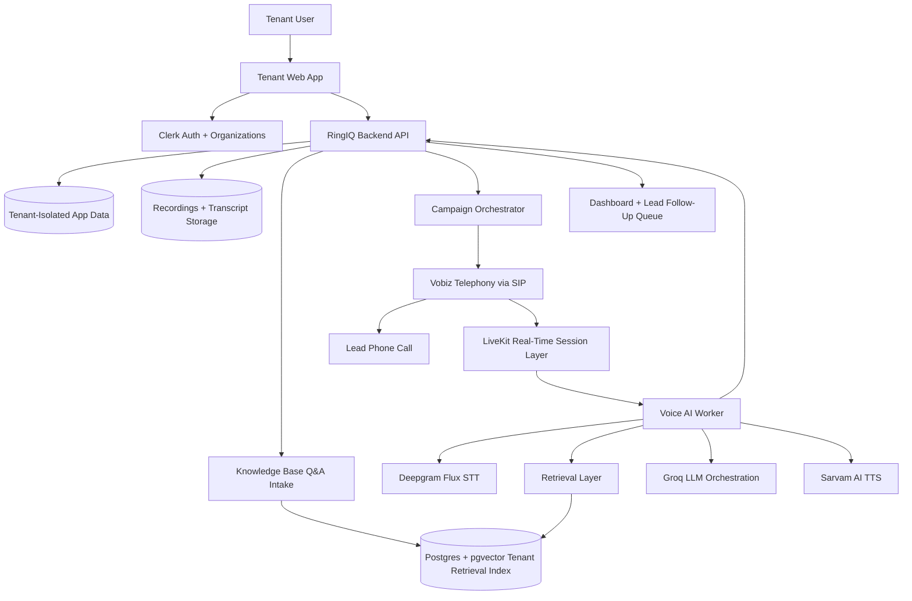

# RingIQ High-Level Architecture Document

Date: 2026-07-16  
Product: RingIQ Voice AI SaaS  
Stage: HLD / pre-detailed architecture

## 1. Purpose

This document describes the high-level architecture for RingIQ, a multi-tenant B2B SaaS platform that enables businesses to upload leads, configure a private knowledge base, and run AI voice calls for lead qualification.

The goal of this HLD is to define the major system components, ownership boundaries, provider choices, and key architecture invariants before moving into detailed technical architecture.

## 2. Scope

### In Scope

- Tenant authentication and organization separation.
- Lead upload and campaign setup.
- Tenant-specific knowledge base intake using category-specific Q&A forms.
- AI-generated call flow based on tenant profile, campaign goal, lead context, and knowledge base.
- Outbound introductory voice calls with retry handling.
- Real-time Hindi and/or English conversation pipeline.
- Lead interest classification.
- Dashboard for interested leads, call logs, recordings, transcripts, and knowledge gaps.
- Tenant-isolated storage and retrieval.

### Out of Scope for This HLD

- Detailed database schema.
- Detailed API contracts.
- Infrastructure sizing.
- Pricing and billing.
- Formal DND, consent, and regulatory workflows.
- Automated live transfer to human sales teams.
- Detailed deployment topology.

## 3. Architecture Principles

1. Tenant isolation is a core product invariant.
   Each tenant's leads, users, calls, transcripts, recordings, knowledge base, retrieval index, and dashboard data must remain isolated from every other tenant.

2. The voice pipeline should be provider-swappable where practical.
   Telephony, STT, LLM, and TTS choices should be integrated behind clear application boundaries so future provider changes do not require rewriting tenant or campaign logic.

3. Real-time call behavior should stay simple in v1.
   The initial system should focus on one introductory qualification call per lead, configurable retries, natural conversation, classification, and handoff to the tenant's sales team through the dashboard.

4. Knowledge grounding should use retrieval, not one giant prompt.
   Tenant knowledge should be collected, chunked, indexed, retrieved per turn, and injected into the LLM context as relevant snippets.

5. Human sales follow-up remains tenant-owned.
   RingIQ surfaces qualified leads and conversation context; it does not automatically transfer calls to live agents in v1.

## 4. High-Level Architecture Diagram

## 5. Component Responsibilities

| Component | Responsibility |
| --- | --- |
| Tenant Web App | Tenant-facing interface for login, organization access, lead upload, knowledge base setup, campaign configuration, dashboard review, and call history. |
| Clerk Auth + Organizations | Authentication, user identity, sessions, and tenant organization membership. Clerk Organizations represent tenant workspaces. |
| RingIQ Backend API | Owns product logic, tenant authorization checks, lead management, campaign state, call lifecycle records, dashboard data, and integration coordination. |
| Tenant-Isolated App Data | Stores tenant-scoped entities such as leads, campaigns, users, call attempts, lead status, classifications, summaries, and audit logs. |
| Knowledge Base Q&A Intake | Category-specific form used by tenants to provide structured business knowledge. Real estate is the first supported category. |
| Tenant Retrieval Index | Tenant-scoped searchable index created from Q&A answers and optional additional knowledge data, stored in Postgres with pgvector. |
| Campaign Orchestrator | Schedules call attempts, applies retry rules, tracks call states, and triggers outbound calling through telephony integration. |
| Vobiz Telephony | Planned outbound telephony provider for placing calls through SIP, receiving call status updates, and connecting call media into the real-time voice stack. |
| LiveKit Real-Time Session Layer | Real-time media/session layer for voice-agent calls, including audio flow between telephony and the AI worker. |
| Voice AI Worker | Runtime process that coordinates STT, retrieval, LLM reasoning, TTS, call state, classification, and event logging during a live call. |
| Deepgram Flux STT | Speech-to-text provider for transcribing lead speech during real-time conversational calls. Flux is selected for v1 because it is oriented toward conversational voice agents. |
| Groq LLM Orchestration | LLM inference provider. `llama-3.3-70b-versatile` is selected for v1 orchestration. |
| Sarvam AI TTS | Text-to-speech provider for natural Indian-language voice output, using Sarvam's Bulbul v3 family. |
| Dashboard + Lead Follow-Up Queue | Tenant-facing view of interested leads, callback requests, summaries, transcripts, recordings, and knowledge gaps. |

## 6. Core Voice AI Flow

1. Tenant user signs in through Clerk and selects their organization.
2. Tenant uploads leads with mandatory fields: name, email, and phone number.
3. Tenant completes the category-specific knowledge base Q&A form.
4. RingIQ creates tenant-scoped knowledge chunks and updates the tenant retrieval index.
5. Tenant configures and launches a campaign.
6. Campaign Orchestrator selects eligible leads and initiates outbound calls through Vobiz.
7. Vobiz places the call through SIP and connects the live call session to LiveKit.
8. Voice AI Worker joins the LiveKit session.
9. Deepgram transcribes the lead's speech.
10. Retrieval Layer fetches relevant tenant knowledge for the current conversation turn.
11. Groq LLM generates the next response using the system prompt, call flow, lead context, call state, and retrieved tenant knowledge.
12. Sarvam AI converts the response into speech.
13. The conversation continues until the call reaches a natural end state.
14. Voice AI Worker classifies the lead, captures callback intent if present, logs transcript/events, and flags knowledge gaps.
15. RingIQ Backend updates the dashboard and follow-up queue for tenant users.

## 7. Tenant Isolation Boundaries

Tenant isolation applies across:

- Auth organization membership.
- Lead records.
- Campaigns.
- Knowledge base Q&A answers.
- Additional uploaded knowledge data.
- Retrieval chunks and indexes.
- Call attempts and call events.
- Recordings and transcripts.
- Lead classifications and summaries.
- Dashboard access.

The application backend must enforce tenant authorization on every product data access. Clerk identifies the user and organization, but RingIQ remains responsible for tenant-scoped product authorization and data boundaries.

## 8. Knowledge Retrieval Approach

RingIQ should not pass the entire tenant knowledge base as one large system prompt.

The v1 approach should be a simple tenant-scoped retrieval layer:

1. Tenants answer a structured category-specific Q&A form.
2. Optional additional knowledge data can supplement those answers.
3. The backend converts approved knowledge into chunks.
4. Chunks are stored in a tenant-specific retrieval index.
5. During a call, the Voice AI Worker retrieves the most relevant chunks for the current conversation turn.
6. Retrieved snippets are inserted into the LLM context alongside:
   - RingIQ system instructions.
   - Tenant profile.
   - Campaign goal.
   - Lead context.
   - Current call state.
   - Conversation history summary.

LangGraph is not required for v1 unless the call orchestration becomes meaningfully more complex. A simpler retrieval and state-management layer should be enough for the first real-estate-focused product.

## 9. Provider Choices and Validation Notes

| Area | Planned Choice | Notes |
| --- | --- | --- |
| Auth | Clerk | Use Clerk Organizations for tenant workspaces. RingIQ backend still owns tenant authorization for product data. |
| Telephony | Vobiz over SIP | Planned provider and integration path. Vobiz will connect into the real-time call stack through SIP. |
| Real-Time Voice Session | LiveKit | Use as the real-time media/session layer between telephony and the AI voice worker. |
| STT | Deepgram Flux | Selected for v1 because it is better aligned with conversational voice-agent use cases. |
| LLM | Groq `llama-3.3-70b-versatile` | Selected for v1. No further model validation is required for now. |
| TTS | Sarvam AI Bulbul v3 | Validate voice quality, streaming latency, Hindi/English pronunciation, Hinglish handling, and telephony audio quality. |
| RAG Storage | Postgres with pgvector | Use Postgres with pgvector for tenant-scoped retrieval. Detailed schema will be finalized later. |
| RAG Orchestration | Simple retrieval layer first | Chunk tenant Q&A and additional knowledge, retrieve relevant context per turn, defer LangGraph unless workflow complexity demands it. |

## 10. Key Product Data Groups

At a high level, RingIQ will manage these product data groups:

- Tenant and organization context.
- Tenant users and access.
- Lead lists.
- Category-specific lead fields.
- Knowledge base Q&A answers.
- Optional additional knowledge data.
- Campaigns.
- Call attempts and retry state.
- Live call events.
- Transcripts.
- Recordings.
- Lead interest classifications.
- Callback requests.
- Knowledge gap flags.
- Dashboard follow-up queue.

Detailed schemas will be defined in the detailed architecture phase.

## 11. Architecture Decisions and Open Items

### Resolved for v1

1. Vobiz integration path.
   Use SIP.

2. STT model selection.
   Use Deepgram Flux.

3. LLM model.
   Use Groq `llama-3.3-70b-versatile` for now. No additional model validation is required before architecture proceeds.

4. Retrieval storage.
   Use Postgres with pgvector. Detailed schema will be finalized later in the architecture plan.

### Deferred / Still Open

5. Knowledge base Q&A definition.
   Define the first real-estate Q&A template, required fields, optional fields, and minimum completeness rules for campaign launch.

6. Recording and transcript retention.
   Data is retained indefinitely for now, but storage cost and lifecycle policy should be revisited before production scale.

7. Callback date/time handling.
   Needs discussion. Define how callback requests are normalized, displayed, and validated across time zones.

8. Observability.
   Define the minimum events and metrics needed for call debugging, tenant reporting, AI quality review, and provider reliability tracking.

## 12. Source Notes

Provider and capability assumptions were checked against the following public documentation:

- LiveKit Agents: https://docs.livekit.io/agents/
- LiveKit Telephony: https://docs.livekit.io/telephony/
- Deepgram models and languages: https://developers.deepgram.com/docs/models-languages-overview
- Groq models: https://console.groq.com/docs/models
- Sarvam documentation index: https://docs.sarvam.ai/llms.txt
- Sarvam LiveKit voice agent guide: https://docs.sarvam.ai/api/integration/build-voice-agent-with-live-kit

Vobiz remains the planned telephony provider, with SIP selected as the integration path.
