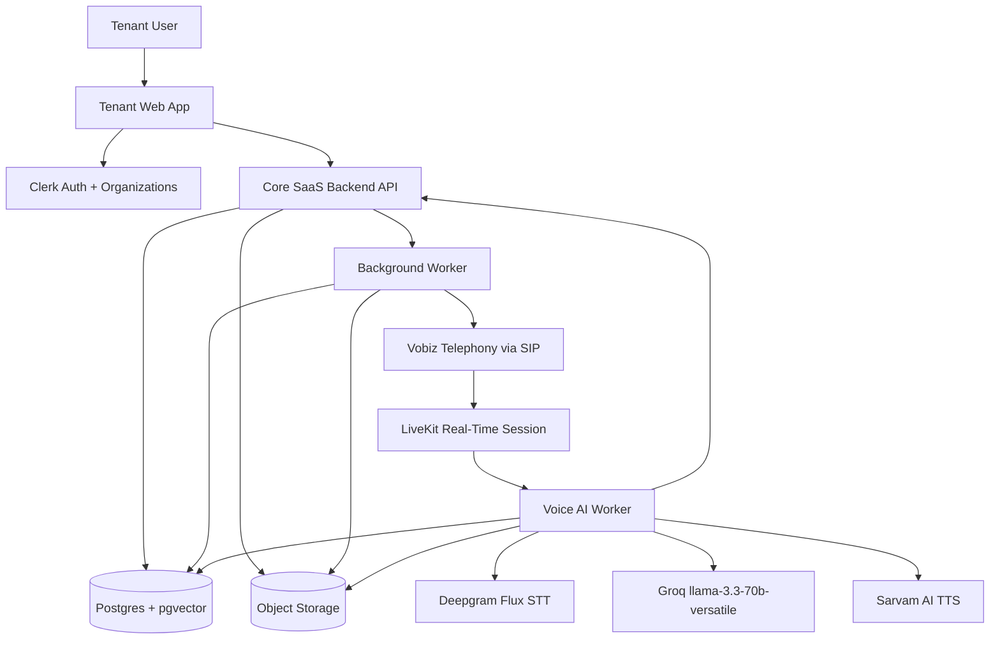

# RingIQ Service Boundary Document

Date: 2026-07-16  
Product: RingIQ Voice AI SaaS  
Stage: Pre-ERD / pre-low-level design

## 1. Purpose

This document breaks RingIQ into service and module boundaries before ERD and low-level design work begins.

The goal is to keep the v1 architecture simple while still isolating the parts of the system that have very different runtime characteristics:

- Tenant-facing CRUD and dashboard workflows.
- Background campaign and post-call processing.
- Real-time voice AI call execution.
- Shared tenant-isolated data and storage.

This is not a full microservices design. For v1, RingIQ should use a small number of deployable boundaries and keep most product concepts as modules inside those boundaries.

## 2. Guiding Decision

RingIQ v1 should separate:

1. The frontend layer.
2. The core SaaS backend for tenant/product workflows.
3. Background workers for async jobs and campaign orchestration.
4. The real-time Voice AI Worker for live calls.
5. Shared data and storage infrastructure.

This gives the voice pipeline enough isolation to scale, fail, and evolve separately from ordinary SaaS CRUD flows without forcing the product into premature microservices.

## 3. V1 Deployable Boundaries

| Deployable | Type | Primary Responsibility |
| --- | --- | --- |
| Tenant Web App | Frontend app | Tenant-facing UI for auth, org selection, lead upload, knowledge setup, campaign setup, dashboard, call review, and follow-up queue. |
| Core SaaS Backend API | Backend service | Product API and source of truth for tenants, leads, campaigns, knowledge base records, call records, dashboard data, and authorization. |
| Background Worker | Worker process | Async jobs such as CSV processing, campaign scheduling, retry handling, embedding generation, post-call summarization, and knowledge gap extraction. |
| Voice AI Worker | Real-time worker process | Live call runtime that joins LiveKit sessions and coordinates STT, retrieval, LLM, TTS, call state, and call classification. |
| Postgres + pgvector | Data store | Tenant-scoped product data and retrieval index storage. |
| Object Storage | File/artifact storage | Call recordings, large transcript artifacts if needed, exports, and other file-like artifacts. |
| External Providers | Managed services | Clerk, Vobiz over SIP, LiveKit, Deepgram Flux, Groq, and Sarvam AI. |

## 4. High-Level Service Diagram



## 5. Tenant Web App

### Owns

- Clerk-powered login and session entry points.
- Tenant organization selection.
- Lead upload UI.
- CSV validation feedback display.
- Business profile forms.
- Real-estate Knowledge Base Q&A forms.
- Campaign setup screens.
- Campaign readiness display.
- Dashboard and filtering UI.
- Lead detail view.
- Transcript, recording, summary, and knowledge gap views.

### Does Not Own

- Tenant authorization rules.
- Campaign execution.
- Retry scheduling.
- Voice call state.
- Retrieval decisions.
- Provider integrations.

The frontend should treat the Core SaaS Backend API as the product authority. Clerk provides identity and session context, but backend authorization still decides which tenant data can be accessed.

## 6. Core SaaS Backend API

The Core SaaS Backend API is the main product backend and source of truth for tenant-scoped workflows.

### Owns

- Tenant and organization mapping from Clerk.
- Tenant-scoped authorization checks.
- Lead import records and lead lifecycle state.
- Campaign creation and campaign configuration.
- Campaign readiness rules.
- Knowledge base Q&A records.
- Additional knowledge data records.
- Call records and call attempt state.
- Lead classifications and follow-up queue data.
- Callback request records.
- Dashboard read APIs.
- Provider webhook endpoints where required.
- Audit metadata and product event records.

### Does Not Own

- Real-time call audio processing.
- STT, LLM, and TTS runtime orchestration inside active calls.
- Long-running async processing.
- Direct frontend state management.

### Internal Modules

These should be modules inside the Core SaaS Backend in v1, not separate services:

- Tenant & Auth module.
- Lead module.
- Campaign module.
- Knowledge Base module.
- Retrieval metadata module.
- Call Records module.
- Dashboard module.
- Provider Webhooks module.
- Audit/Event Log module.

## 7. Background Worker

The Background Worker handles jobs that should not run inside a synchronous API request and do not require real-time voice latency.

### Owns

- CSV parsing and row-level import processing.
- Lead validation jobs.
- Knowledge chunk creation.
- Embedding generation and pgvector index updates.
- Campaign scheduling.
- Retry scheduling for unanswered calls.
- Triggering outbound call attempts through Vobiz.
- Post-call summarization if not completed by the Voice AI Worker.
- Knowledge gap extraction and normalization.
- Cleanup or lifecycle jobs when retention policy is later introduced.

### Does Not Own

- Live call audio loops.
- Frontend-facing dashboard APIs.
- Tenant authorization policy definition.
- Final product data ownership.

The worker may update product records, but it should do so using the same tenant boundaries and state rules as the Core SaaS Backend.

## 8. Voice AI Worker

The Voice AI Worker is the real-time call runtime. It is deliberately isolated from the main CRUD/product backend because it has different scaling, latency, and failure characteristics.

### Owns

- Joining LiveKit sessions for active calls.
- Receiving and sending real-time audio.
- Coordinating Deepgram Flux STT.
- Fetching relevant tenant knowledge through the retrieval layer.
- Calling Groq `llama-3.3-70b-versatile`.
- Coordinating Sarvam AI TTS.
- Managing per-call conversation state.
- Applying the AI call flow and system prompt.
- Capturing qualification answers provided during the call.
- Classifying the call outcome.
- Emitting call events, transcript segments, summaries, and knowledge gap signals.

### Does Not Own

- Tenant setup.
- Lead upload.
- Campaign creation.
- Retry policy definition.
- Dashboard read models.
- Long-term product data ownership.
- Tenant membership and access control policy.

The Voice AI Worker should receive only the call context it needs for a specific active call. It should not become a general-purpose backend.

## 9. Shared Data and Storage

### Postgres + pgvector

Postgres is the primary product database for v1. pgvector is used for tenant-scoped retrieval over knowledge chunks.

At a high level, Postgres will store:

- Tenant and organization references.
- Tenant users or user mappings.
- Leads.
- Campaigns.
- Knowledge Q&A records.
- Knowledge chunks.
- Embeddings through pgvector.
- Call attempts.
- Call events.
- Lead classification results.
- Callback requests.
- Knowledge gaps.
- Dashboard query data.

Detailed schema design is intentionally deferred to the ERD and low-level design phase.

### Object Storage

Object storage should hold larger artifacts that do not belong directly in relational tables:

- Call recordings.
- Large transcript files if transcripts grow beyond practical database storage.
- CSV import source files if retained.
- Future exports.

The database should store metadata and storage references. Tenant access to objects must still be enforced through backend authorization.

## 10. Communication Boundaries

| From | To | Communication Type | Purpose |
| --- | --- | --- | --- |
| Tenant Web App | Core SaaS Backend API | HTTPS/API | Product workflows and dashboard data. |
| Tenant Web App | Clerk | Clerk SDK/session flow | Authentication and organization selection. |
| Core SaaS Backend API | Postgres + pgvector | Database access | Product data and retrieval metadata. |
| Core SaaS Backend API | Object Storage | Storage API | Recording/transcript/export references and access. |
| Core SaaS Backend API | Background Worker | Job enqueue / internal trigger | Async work such as imports, retries, embeddings, and post-call processing. |
| Background Worker | Vobiz | Provider API/SIP initiation path | Trigger outbound call attempts. |
| Vobiz | LiveKit | SIP/media integration | Connect phone call media into the real-time session. |
| LiveKit | Voice AI Worker | Real-time session/media | Run active AI voice conversation. |
| Voice AI Worker | Deepgram Flux | Streaming STT | Convert lead speech to text. |
| Voice AI Worker | Groq | LLM API | Generate grounded conversational responses and classifications. |
| Voice AI Worker | Sarvam AI | TTS API/stream | Convert AI responses to speech. |
| Voice AI Worker | Core SaaS Backend API / DB | Internal API or controlled DB access | Persist call events, transcript segments, classification, callback intent, and knowledge gaps. |

The exact internal communication style between API, worker, and Voice AI Worker can be finalized during low-level design. The boundary principle is more important at this stage than the specific queue or event bus.

## 11. Data Ownership Rules

1. Core SaaS Backend owns product truth.
   Leads, campaigns, tenant knowledge records, call records, classifications, and dashboard state belong to the Core SaaS Backend domain.

2. Voice AI Worker owns live call execution only.
   It can emit facts and events, but it should not become the owner of campaigns, tenants, or lead lifecycle policy.

3. Background Worker owns async execution, not product policy.
   It performs scheduled and expensive work, but it should follow the same product rules as the backend.

4. Tenant isolation is enforced at every boundary.
   Every job, call session, retrieval query, storage object, and dashboard request must carry tenant context.

5. Retrieval data is tenant-scoped.
   Knowledge chunks and embeddings must never be queried across tenants.

## 12. What Not To Split In V1

The following should remain modules, not separate services, unless future scale or team structure forces a split:

- Lead Service.
- Campaign Service.
- Knowledge Base Service.
- Retrieval Service.
- Dashboard Service.
- Transcript Service.
- Classification Service.
- User/Tenant Service.

Splitting these too early would increase operational complexity without improving the v1 product. The one meaningful runtime split is the Voice AI Worker, because live call execution has real-time behavior, external provider orchestration, and scaling needs that differ from CRUD workflows.

## 13. Suggested Build Order

1. Core SaaS Backend with tenant authorization foundation.
2. Tenant Web App shell with Clerk auth and organization flow.
3. Lead upload and validation path.
4. Business profile and real-estate Q&A setup.
5. Postgres + pgvector retrieval module.
6. Campaign setup and readiness checks.
7. Background Worker for imports, embeddings, and campaign scheduling.
8. Vobiz SIP and LiveKit call-session integration.
9. Voice AI Worker for real-time conversation.
10. Call records, classification, transcripts, recordings, and dashboard follow-up queue.
11. Knowledge gap loop.

## 14. Open Questions Before LLD

1. Should the Voice AI Worker write directly to Postgres, or should it emit events through the Core SaaS Backend?
   Prefer starting with a controlled internal API or event path if it keeps tenant authorization and state transitions cleaner.

2. What job system should run Background Worker tasks?
   This can be decided during low-level design after the backend framework is chosen.

3. How should callback date/time normalization work?
   This remains a product and architecture discussion item.

4. Which artifacts belong in Postgres versus Object Storage?
   Recordings should be object storage. Transcript storage can be decided based on expected size and query needs.

5. What is the minimum observability event set for v1?
   This is deferred, but should be defined before implementation starts.

## 15. Current Service Boundary Recommendation

For v1, use a modular backend plus isolated real-time voice worker:

```text
Tenant Web App
  -> Core SaaS Backend API
      -> Postgres + pgvector
      -> Object Storage
      -> Background Worker
          -> Vobiz SIP
              -> LiveKit
                  -> Voice AI Worker
                      -> Deepgram Flux
                      -> Groq llama-3.3-70b-versatile
                      -> Sarvam AI
```

This keeps RingIQ simple enough to build while giving the voice pipeline the isolation it deserves.
